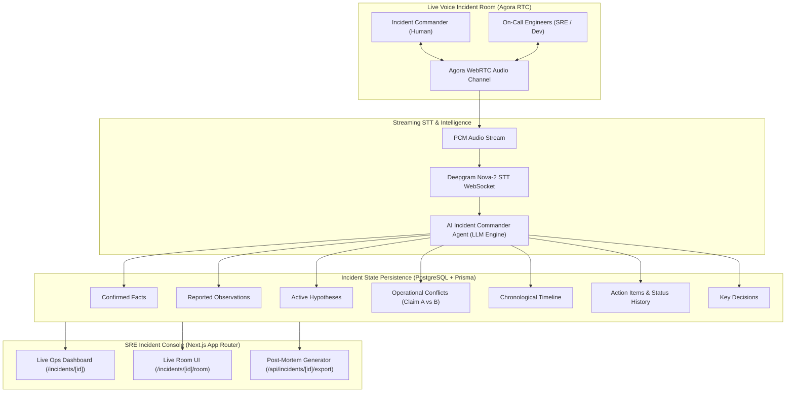

# AI Incident Commander - System Architecture

---

## Core Safety Principles

1. **AI Never Declares Root Cause**: The AI structures evidence, notes discrepancies, and drafts hypotheses; only human incident commanders can promote a hypothesis to a confirmed fact.
2. **Explicit Verification Model**: Reported observations remain distinct from confirmed facts until explicitly verified by team members.
3. **Audit History Tracking**: Every state transition (Action item status changes, Fact verifications, Conflict resolutions) is appended to an immutable status history and chronological event timeline.
4. **Resilient Sandbox Fallbacks**: If Agora credentials or external STT providers are unconfigured, the system automatically runs in simulated sandbox mode without crashing.
